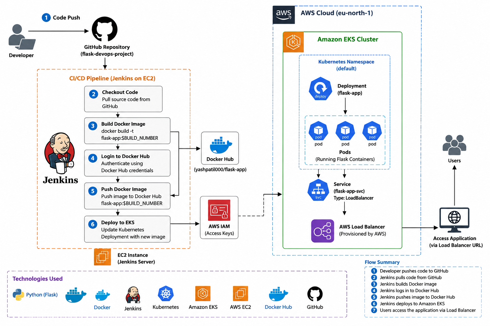

# 🚀 End-to-End CI/CD Pipeline for Python Flask Application on Amazon EKS

<p align="center">


### Internship Final Project

### **CI/CD Pipeline using Jenkins, Docker, Docker Hub & Amazon EKS**

</p>

---

# 📌 Project Overview

This project demonstrates a complete **CI/CD (Continuous Integration and Continuous Deployment)** pipeline for deploying a **Python Flask application** on **Amazon Elastic Kubernetes Service (EKS)**.

The entire deployment process is automated using **Jenkins**, **Docker**, **Docker Hub**, and **Kubernetes**. Whenever code is pushed to the GitHub repository, Jenkins automatically builds a Docker image, pushes it to Docker Hub, and deploys the latest version to Amazon EKS.

---

# 🎯 Project Objectives

- Automate the application deployment process.
- Build Docker images automatically.
- Push Docker images to Docker Hub.
- Deploy applications on Amazon EKS.
- Implement Continuous Integration and Continuous Deployment (CI/CD).
- Reduce manual deployment efforts.
- Learn real-world DevOps workflow.

---

# 🛠 Technologies Used

| Category | Technology |
|-----------|------------|
| Cloud Platform | AWS |
| Compute | Amazon EC2 |
| Kubernetes | Amazon EKS |
| CI/CD | Jenkins |
| Containerization | Docker |
| Registry | Docker Hub |
| Programming Language | Python |
| Framework | Flask |
| Version Control | Git |
| Repository | GitHub |
| CLI Tools | AWS CLI, kubectl |
| Operating System | Amazon Linux 2023 / RHEL 9 |

---

#  Project Structure

```text
flask-devops-project/
│
├── app.py
├── requirements.txt
├── Dockerfile
├── Jenkinsfile
├── deployment.yaml
├── service.yaml
├── .dockerignore
├── README.md

```

---

# 🏗 Architecture Diagram


```markdown

```

---

#  Project Workflow

```text
Developer
      │
      ▼
GitHub Repository
      │
      ▼
Jenkins Pipeline
      │
      ▼
Build Docker Image
      │
      ▼
Push Image to Docker Hub
      │
      ▼
Deploy on Amazon EKS
      │
      ▼
Python Flask Application
```

---

#  Module 1 : AWS Infrastructure Setup

## Create

- AWS Account
- IAM User
- VPC
- Internet Gateway
- Security Group
- EC2 Instance (Jenkins Server)

## Install Required Packages

```bash
sudo dnf update -y
sudo dnf install git docker awscli -y
```

Verify Installation

```bash
git --version
docker --version
aws --version
kubectl version --client
```

---

# Module 2 : Jenkins Installation

Install Java

```bash
sudo dnf install java-21-amazon-corretto -y
```

Install Jenkins

```bash
sudo wget -O /etc/yum.repos.d/jenkins.repo \
https://pkg.jenkins.io/redhat-stable/jenkins.repo

sudo rpm --import https://pkg.jenkins.io/redhat-stable/jenkins.io-2023.key

sudo dnf install jenkins -y
```

Start Jenkins

```bash
sudo systemctl enable jenkins
sudo systemctl start jenkins
```

Check Status

```bash
sudo systemctl status jenkins
```

Access Jenkins

```
http://PUBLIC-IP:8080
```

---

# Module 3 : Create Amazon EKS Cluster

Create Cluster

```bash
eksctl create cluster \
--name flask-cluster \
--region ap-south-1 \
--nodes 2
```

Verify

```bash
kubectl get nodes
```

---

#  Module 4 : Build Python Flask Application

Create

- app.py
- requirements.txt

Run Application

```bash
python app.py
```

Test

```
http://SERVER-IP:5000
```

---

#  Module 5 : Dockerize Application

Create Dockerfile

```dockerfile
FROM python:3.11-slim

WORKDIR /app

COPY requirements.txt .

RUN pip install --no-cache-dir -r requirements.txt

COPY . .

EXPOSE 5000

CMD ["python","app.py"]
```

Build Image

```bash
docker build -t flask-app .
```

Run Container

```bash
docker run -d -p 5000:5000 flask-app
```

Verify

```bash
docker ps
```

---

# Module 6 : Push Image to Docker Hub

Login

```bash
docker login
```

Tag Image

```bash
docker tag flask-app YOUR_DOCKERHUB_USERNAME/flask-app:v1
```

Push Image

```bash
docker push YOUR_DOCKERHUB_USERNAME/flask-app:v1
```

Verify on Docker Hub.

---

# Module 7 : Deploy Application on Amazon EKS

Deploy

```bash
kubectl apply -f deployment.yaml
kubectl apply -f service.yaml
```

Verify

```bash
kubectl get deployments
kubectl get pods
kubectl get svc
```

---

#  Module 8 : Jenkins CI/CD Pipeline

Pipeline Stages

- Checkout Source Code
- Build Docker Image
- Docker Login
- Push Docker Image
- Deploy to Amazon EKS
- Rolling Update

Run Pipeline

```
Build Now
```

Verify Pipeline Success.

---

# Jenkins Pipeline Flow

```text
GitHub
   │
   ▼
Jenkins
   │
   ▼
Build Docker Image
   │
   ▼
Push Image to Docker Hub
   │
   ▼
Deploy to Amazon EKS
   │
   ▼
Running Flask Application
```

---

---

# ✨ Features

- End-to-End CI/CD Pipeline
- Automated Docker Image Build
- Docker Hub Integration
- Kubernetes Deployment
- Rolling Updates
- Amazon EKS Deployment
- GitHub Integration
- Jenkins Automation

---

# 📚 Learning Outcomes

- Amazon EC2
- Amazon EKS
- Jenkins
- Docker
- Docker Hub
- Kubernetes
- Python Flask
- GitHub
- AWS CLI
- kubectl
- CI/CD Pipeline

---

# 🚀 Future Enhancements

- GitHub Webhooks
- SonarQube Integration
- Trivy Image Scanning
- Prometheus Monitoring
- Grafana Dashboard
- Helm Charts
- ArgoCD
- Terraform

---

# 🏁 Conclusion

This project successfully demonstrates the implementation of a complete **CI/CD pipeline** for a **Python Flask application** using **Jenkins, Docker, Docker Hub, Amazon EKS, and Kubernetes**. The pipeline automates code integration, image creation, and deployment, providing a scalable, reliable, and production-ready DevOps workflow while enhancing practical cloud and automation skills.

---


Internship Final Project

---

## ⭐ If you found this project useful, don't forget to Star this repository!
